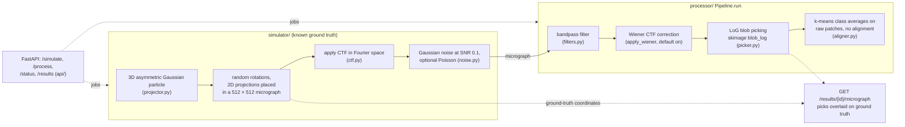
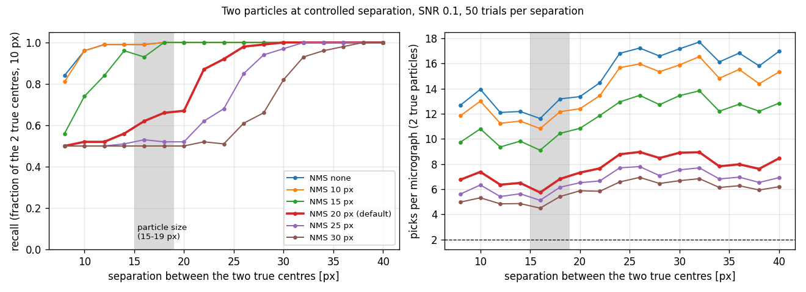

# CryoEM Simulation & Processing Pipeline

A Python package that simulates synthetic cryoEM data and processes it through a realistic image-analysis pipeline, wrapped in a FastAPI REST service.

---

## Overview

CryoEM (cryo-electron microscopy) determines 3D structures of biological molecules at near-atomic resolution. Each raw image (*micrograph*) is a noisy 2D projection of thousands of randomly-oriented protein copies, modulated by the **Contrast Transfer Function (CTF)** of the microscope. Recovering the 3D structure requires:

1. **Simulate**: generate a micrograph (or particle stack) with known ground-truth
2. **Filter**: bandpass-filter and correct CTF phase flips (Wiener filter)
3. **Pick**: locate particle centres with blob detection
4. **Average**: cluster picked particles and average within each class to boost SNR

This repo implements all four steps with a FastAPI wrapper for programmatic access.



---

## Project structure

```
cryoem_pipeline/
├── simulator/
│   ├── projector.py  : 3D particle volume + projection engine
│   ├── ctf.py        : CTF computation and application
│   ├── noise.py      : Gaussian + Poisson noise models
│   └── generator.py  : SimulationConfig, micrograph / stack generators, I/O
├── processor/
│   ├── filters.py    : bandpass filter, Wiener CTF correction
│   ├── picker.py     : LoG blob-detection particle picker
│   ├── aligner.py    : k-means class averaging
│   └── pipeline.py   : Pipeline class (pending→running→done/failed)
├── api/
│   ├── models.py     : Pydantic request / response models
│   ├── routes.py     : FastAPI route handlers
│   └── main.py       : FastAPI app with CORS
├── benchmarks/
│   ├── picker_benchmark.py : picker precision/recall on held-out synthetic micrographs
│   └── nms_separation.py   : recall of two particles against their separation, per suppression radius
├── tests/
│   ├── test_simulator.py
│   ├── test_api.py
│   └── test_processor.py
└── requirements.txt
```

---

## Physics background

### Particle model
The synthetic particle is a 3D asymmetric Gaussian density:

- **Primary blob**: elongated along x (σ_x > σ_y > σ_z), breaks orientational symmetry
- **Satellite blob**: 50% amplitude, offset from centre, mimics a second protein domain

Different orientations yield visibly different 2D projections, which is essential for class averaging to separate orientation classes.

### CTF
The standard phase-contrast CTF is:

```
γ(k) = π λ Δf k² + (π/2) Cs λ³ k⁴
CTF(k) = −√(1−Q²) sin γ(k) + Q cos γ(k)
```

| Symbol | Meaning | Typical value |
|--------|---------|---------------|
| k      | spatial frequency [Å⁻¹] | n/a |
| λ      | relativistic electron wavelength [Å] | 0.01969 Å @ 300 kV |
| Δf     | defocus [Å] | 2 μm = 20 000 Å |
| Cs     | spherical aberration [Å] | 2 mm = 2×10⁷ Å |
| Q      | amplitude contrast fraction | 0.07 |

Applied by Fourier-space multiplication: `image_CTF = IFFT(FFT(image) × CTF)`.

### Wiener CTF correction
Near CTF zeroes the signal is destroyed; simple division would amplify noise. The Wiener estimator regularises the inversion:

```
W(k) = CTF(k) / (CTF(k)² + 1/SNR)
```

Lower SNR → heavier regularisation → smoother correction.


*Top: the CTF at the default simulation settings, with the default bandpass range shaded (its upper
edge coincides with the Nyquist frequency at 2 Å/pixel). Bottom: the Wiener filter for the pipeline's
default SNR estimate (0.1) and two larger values. At 0.1 the regularisation term dominates, so
W(k) ≈ 0.1 · CTF(k): the correction mainly flips the sign of the negative CTF lobes and rescales,
rather than amplifying frequencies between the zeros. Computed with `simulator.ctf.compute_ctf_2d`
by [`docs/figures/make_ctf_figure.py`](docs/figures/make_ctf_figure.py).*

---

## Example output

One run of the full simulate, filter, pick and average sequence with the settings of the Python API
example below (`SimulationConfig(n_particles=100, seed=42)`, default `ProcessConfig`, 5 classes). This
is a demonstration of the pipeline on synthetic data with known ground truth, not a validated particle
picker.


*Top left: the simulated 512 × 512 micrograph. 100 particles were requested but only 32 were placed:
the non-overlap placement saturates at roughly 28 to 35 particles for a 64 px box on this micrograph
(seeds 0 to 9), so any request above about 30 is capped, with a `PlacementSaturationWarning`. Top
right: after bandpass and Wiener filtering, with ground-truth centres (circles) and LoG picks (crosses)
from the default picker, which suppresses any detection within 20 px (about one particle diameter) of a
stronger one. Matching each pick to at most one true centre within 10 px, all 32 particles are found
(recall 1.00) among 54 picks (precision 0.59); with a stricter 5 px match recall is 0.91. Of the 22
unmatched picks, 10 lie within half a box (32 px) of a true particle and 12 are in the background.
Without suppression the same micrograph gives 137 picks (precision 0.23), mostly repeated detections on
each particle's bright CTF fringe lobes. Bottom: k-means class averages of the 48 picks whose full box
fits inside the micrograph; the two small classes collect false picks. Single seeded run, generated by
[`docs/figures/make_pipeline_figure.py`](docs/figures/make_pipeline_figure.py).*

### Picker accuracy on held-out micrographs

`benchmarks/picker_benchmark.py` measures precision and recall against the known centres on 30
micrographs per condition (seeds 200 to 229, not used to choose any setting; the suppression radius
was chosen on seeds 100 to 109 and matches the 15 to 19 px particle size). Matching radius 10 px, mean
over micrographs ([`benchmarks/picker_benchmark.txt`](benchmarks/picker_benchmark.txt)):

| Condition | Precision, no suppression | Precision, 20 px suppression (default) | Recall, both |
|---|---|---|---|
| SNR 0.1, about 32 particles | 0.27 | 0.70 | 1.00 |
| SNR 0.05, about 32 particles | 0.23 | 0.47 | 1.00 |
| SNR 0.2, about 32 particles | 0.29 | 0.86 | 1.00 |
| SNR 0.1, 15 particles | 0.26 | 0.79 | 1.00 |

Suppression can keep an off-centre detection instead of the central one: with a stricter 5 px match,
recall is 0.80 to 0.82 with suppression against 0.86 to 0.88 without. Set `nms_radius=None` in
`ProcessConfig` to recover the unsuppressed picks. These are synthetic micrographs from this
repository's own simulator, with well-separated particles; the numbers do not describe performance
on real data or on crowded micrographs where particles touch.

### Close neighbours: the suppression radius is also a resolution limit

The simulator never places particles closer than one box (64 px), so the benchmark above cannot show
whether suppression merges genuine neighbours. `benchmarks/nms_separation.py` answers that directly:
two particles, built with the simulator's own projection, CTF and noise at the same particle density,
are placed at a controlled separation, and the picker is run with different radii (50 trials per
separation, [`benchmarks/nms_separation.txt`](benchmarks/nms_separation.txt)).



*Recall is the fraction of the two true centres recovered within 10 px, averaged over 50 trials. The
grey band marks the particle size. Pick counts are higher than in the full-size benchmark because
the picker normalises intensities per image and these images are small; compare recall only.*

With the default 20 px radius, both particles are found when their centres are at least 26 px apart
(recall 0.98 or more), recall is 0.92 at 24 px and 0.67 to 0.87 at 20 to 22 px, and at 18 px or
less typically one particle of the pair is lost (recall 0.5 to 0.66). Two particles touching each
other (centres 15 to 19 px apart) are therefore often merged. A smaller radius does not fix this
cheaply: the duplicate detections that suppression removes sit on each particle's CTF fringes 16 to
24 px from its centre, the same distances as a touching neighbour. On the development micrographs
(seeds 100 to 109, SNR 0.05 to 0.2) a 15 px radius keeps only a small part of the precision gain
(precision 0.33 against 0.66 at 20 px and 0.26 without suppression), so the default stays at 20 px
and this resolution limit is a known property of the picker. Suppression by distance alone cannot
separate fringe duplicates from genuine close neighbours.

---

## Installation

```bash
pip install -r requirements.txt
```

Dependencies: `fastapi`, `uvicorn[standard]`, `pydantic`, `numpy`, `scipy`, `scikit-image`, `scikit-learn`, `mrcfile`, `matplotlib`, `pytest`, `httpx`.

---

## Running the API

```bash
cd cryoem_pipeline
uvicorn api.main:app --reload
```

Interactive docs: http://127.0.0.1:8000/docs

---

## API quick-start

### 1. Simulate a micrograph

```bash
curl -s -X POST http://localhost:8000/simulate \
  -H 'Content-Type: application/json' \
  -d '{"n_particles": 50, "seed": 42}' | python3 -m json.tool
```

Returns `{"job_id": "<uuid>", "status": "pending", ...}`.

### 2. Poll until done

```bash
curl http://localhost:8000/status/<job_id>
```

### 3. Process (filter → pick → average)

```bash
curl -s -X POST http://localhost:8000/process \
  -H 'Content-Type: application/json' \
  -d '{"job_id": "<job_id>", "n_classes": 5}'
```

### 4. View images

```
GET /results/<job_id>/micrograph   → PNG with ground-truth + picked overlays
GET /results/<job_id>/stack        → PNG montage of first 25 particles
GET /results/<job_id>/classes      → PNG montage of class averages
GET /results/<job_id>/process      → JSON summary (n_picked, pick coords, class stats)
```

---

## Running tests

```bash
cd cryoem_pipeline
pytest tests/ -v
```

The test suite covers:
- Projector: volume shape/range/dtype, rotation matrix orthonormality, projection shape
- CTF: electron wavelength at 300 kV, CTF value range, apply_ctf shape preservation
- Noise: Gaussian/Poisson noise shape and variance increase
- Generator: micrograph/stack shape, coord bounds, seed reproducibility
- Placement: all-placed and saturated cases, the saturation warning, non-overlap, requested/placed
  counts from `run_simulation` and the `/status` endpoint
- Filters: bandpass DC suppression, Wiener shape/dtype
- Picker: coordinate bounds, blob detection on planted signals, confidence range; suppression keeps
  the stronger of two nearby blobs, enforces the radius, merges two blobs only within the radius
  (gaps 14 to 30 px), and leaves the README example's recall at 1
- Aligner: class average shape, label/size consistency, empty-input handling
- Pipeline: status transitions (pending→running→done/failed)

---

## Python API example

```python
from simulator.generator import SimulationConfig, run_simulation
from processor.pipeline import Pipeline, ProcessConfig

# 1. Simulate
cfg = SimulationConfig(n_particles=100, seed=42)
result = run_simulation(cfg, output_dir="outputs/run1")
print(result["ground_truth_coords"][:3])

# 2. Process
from simulator.generator import generate_micrograph
import numpy as np

mic, coords = generate_micrograph(cfg)
pipeline = Pipeline(ProcessConfig(n_classes=5))
proc = pipeline.run(mic)
print(f"Picked {proc.n_picked} particles → {proc.n_classes} classes")
```

`result["n_particles_requested"]` and `result["n_particles_placed"]` give the requested count and the
number actually placed in the micrograph (100 and 32 for this example; the placed centres are
`result["ground_truth_coords"]`). When placement falls short, `generate_micrograph` issues a
`PlacementSaturationWarning`. `result["n_particles"]` is kept for compatibility and is the size of the
separate particle stack, which always equals the requested count. The REST status endpoint reports
`n_particles_requested` and `n_particles_placed`.
