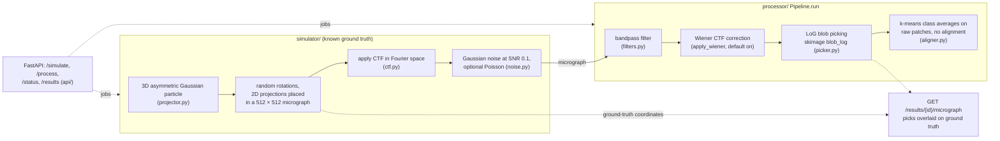
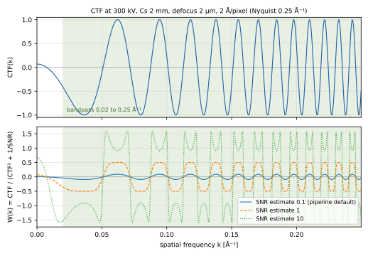
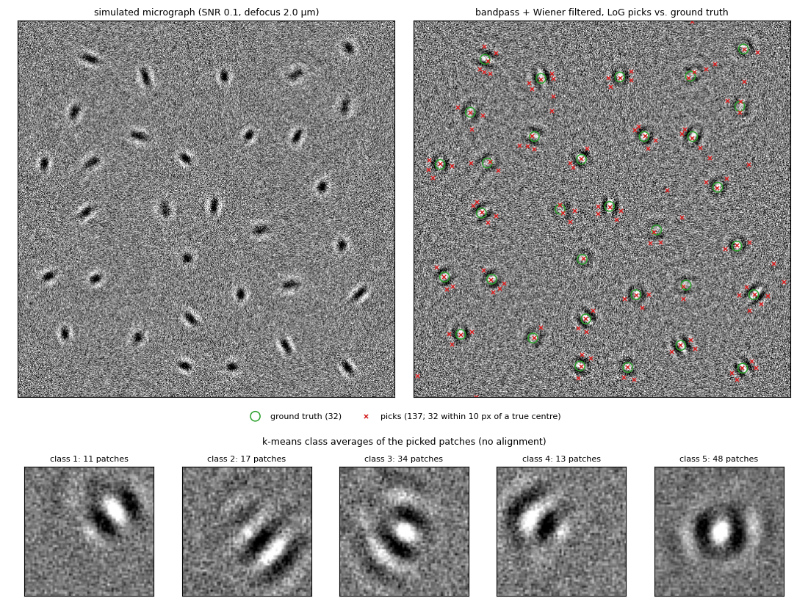

# CryoEM Simulation & Processing Pipeline

A Python package that simulates synthetic cryoEM data and processes it through a realistic image-analysis pipeline, wrapped in a FastAPI REST service.

---

## Overview

CryoEM (cryo-electron microscopy) determines 3D structures of biological molecules at near-atomic resolution. Each raw image (*micrograph*) is a noisy 2D projection of thousands of randomly-oriented protein copies, modulated by the **Contrast Transfer Function (CTF)** of the microscope. Recovering the 3D structure requires:

1. **Simulate**: generate a micrograph (or particle stack) with known ground-truth
2. **Filter**: bandpass-filter and correct CTF phase flips (Wiener filter)
3. **Pick**: locate particle centres with blob detection
4. **Average**: cluster picked particles and average within each class to boost SNR

This repo implements all four steps with a FastAPI wrapper for programmatic access.



---

## Project structure

```
cryoem_pipeline/
├── simulator/
│   ├── projector.py  : 3D particle volume + projection engine
│   ├── ctf.py        : CTF computation and application
│   ├── noise.py      : Gaussian + Poisson noise models
│   └── generator.py  : SimulationConfig, micrograph / stack generators, I/O
├── processor/
│   ├── filters.py    : bandpass filter, Wiener CTF correction
│   ├── picker.py     : LoG blob-detection particle picker
│   ├── aligner.py    : k-means class averaging
│   └── pipeline.py   : Pipeline class (pending→running→done/failed)
├── api/
│   ├── models.py     : Pydantic request / response models
│   ├── routes.py     : FastAPI route handlers
│   └── main.py       : FastAPI app with CORS
├── tests/
│   ├── test_simulator.py
│   └── test_processor.py
└── requirements.txt
```

---

## Physics background

### Particle model
The synthetic particle is a 3D asymmetric Gaussian density:

- **Primary blob**: elongated along x (σ_x > σ_y > σ_z), breaks orientational symmetry
- **Satellite blob**: 50% amplitude, offset from centre, mimics a second protein domain

Different orientations yield visibly different 2D projections, which is essential for class averaging to separate orientation classes.

### CTF
The standard phase-contrast CTF is:

```
γ(k) = π λ Δf k² + (π/2) Cs λ³ k⁴
CTF(k) = −√(1−Q²) sin γ(k) + Q cos γ(k)
```

| Symbol | Meaning | Typical value |
|--------|---------|---------------|
| k      | spatial frequency [Å⁻¹] | n/a |
| λ      | relativistic electron wavelength [Å] | 0.01969 Å @ 300 kV |
| Δf     | defocus [Å] | 2 μm = 20 000 Å |
| Cs     | spherical aberration [Å] | 2 mm = 2×10⁷ Å |
| Q      | amplitude contrast fraction | 0.07 |

Applied by Fourier-space multiplication: `image_CTF = IFFT(FFT(image) × CTF)`.

### Wiener CTF correction
Near CTF zeroes the signal is destroyed; simple division would amplify noise. The Wiener estimator regularises the inversion:

```
W(k) = CTF(k) / (CTF(k)² + 1/SNR)
```

Lower SNR → heavier regularisation → smoother correction.



*Top: the CTF at the default simulation settings, with the default bandpass range shaded (its upper
edge coincides with the Nyquist frequency at 2 Å/pixel). Bottom: the Wiener filter for the pipeline's
default SNR estimate (0.1) and two larger values. At 0.1 the regularisation term dominates, so
W(k) ≈ 0.1 · CTF(k): the correction mainly flips the sign of the negative CTF lobes and rescales,
rather than amplifying frequencies between the zeros. Computed with `simulator.ctf.compute_ctf_2d`
by [`docs/figures/make_ctf_figure.py`](docs/figures/make_ctf_figure.py).*

---

## Example output

One run of the full simulate, filter, pick and average sequence with the settings of the Python API
example below (`SimulationConfig(n_particles=100, seed=42)`, default `ProcessConfig`, 5 classes). This
is a demonstration of the pipeline on synthetic data with known ground truth, not a validated particle
picker.



*Top left: the simulated 512 × 512 micrograph. 100 particles were requested but only 32 were placed:
the non-overlap placement saturates at roughly 28 to 35 particles for a 64 px box on this micrograph
(seeds 0 to 9), so any request above about 30 is silently capped. Top right: after bandpass and Wiener
filtering, with ground-truth centres (circles) and LoG picks (crosses). Matching each pick to at most
one true centre within 10 px, all 32 particles are found (recall 1.00), but 137 picks are made, so
precision is 0.23; the same values hold for matching radii of 10 to 32 px. Of the 105 unmatched picks,
93 lie within half a box (32 px) of a true particle, consistent with repeated detections on each
particle's CTF fringe pattern rather than picks in empty background. Bottom: k-means class averages of
the 123 picks whose full box fits inside the micrograph, so they mix centred particles with off-centre
fringe crops. Single seeded run, generated by
[`docs/figures/make_pipeline_figure.py`](docs/figures/make_pipeline_figure.py).*

---

## Installation

```bash
pip install -r requirements.txt
```

Dependencies: `fastapi`, `uvicorn[standard]`, `pydantic`, `numpy`, `scipy`, `scikit-image`, `scikit-learn`, `mrcfile`, `matplotlib`, `pytest`, `httpx`.

---

## Running the API

```bash
cd cryoem_pipeline
uvicorn api.main:app --reload
```

Interactive docs: http://127.0.0.1:8000/docs

---

## API quick-start

### 1. Simulate a micrograph

```bash
curl -s -X POST http://localhost:8000/simulate \
  -H 'Content-Type: application/json' \
  -d '{"n_particles": 50, "seed": 42}' | python3 -m json.tool
```

Returns `{"job_id": "<uuid>", "status": "pending", ...}`.

### 2. Poll until done

```bash
curl http://localhost:8000/status/<job_id>
```

### 3. Process (filter → pick → average)

```bash
curl -s -X POST http://localhost:8000/process \
  -H 'Content-Type: application/json' \
  -d '{"job_id": "<job_id>", "n_classes": 5}'
```

### 4. View images

```
GET /results/<job_id>/micrograph   → PNG with ground-truth + picked overlays
GET /results/<job_id>/stack        → PNG montage of first 25 particles
GET /results/<job_id>/classes      → PNG montage of class averages
GET /results/<job_id>/process      → JSON summary (n_picked, pick coords, class stats)
```

---

## Running tests

```bash
cd cryoem_pipeline
pytest tests/ -v
```

The test suite covers:
- Projector: volume shape/range/dtype, rotation matrix orthonormality, projection shape
- CTF: electron wavelength at 300 kV, CTF value range, apply_ctf shape preservation
- Noise: Gaussian/Poisson noise shape and variance increase
- Generator: micrograph/stack shape, coord bounds, seed reproducibility
- Filters: bandpass DC suppression, Wiener shape/dtype
- Picker: coordinate bounds, blob detection on planted signals, confidence range
- Aligner: class average shape, label/size consistency, empty-input handling
- Pipeline: status transitions (pending→running→done/failed)

---

## Python API example

```python
from simulator.generator import SimulationConfig, run_simulation
from processor.pipeline import Pipeline, ProcessConfig

# 1. Simulate
cfg = SimulationConfig(n_particles=100, seed=42)
result = run_simulation(cfg, output_dir="outputs/run1")
print(result["ground_truth_coords"][:3])

# 2. Process
from simulator.generator import generate_micrograph
import numpy as np

mic, coords = generate_micrograph(cfg)
pipeline = Pipeline(ProcessConfig(n_classes=5))
proc = pipeline.run(mic)
print(f"Picked {proc.n_picked} particles → {proc.n_classes} classes")
```

`result["n_particles"]` is the size of the separate particle stack (always the requested count). The
number of particles actually placed in the micrograph is `len(result["ground_truth_coords"])` (32 for
this example); the REST API reports it as `n_particles_placed`.
